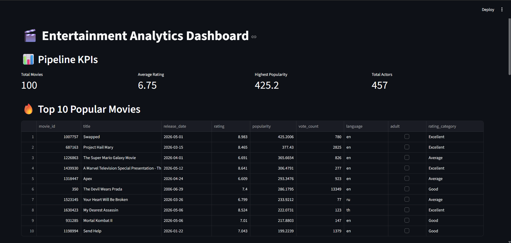
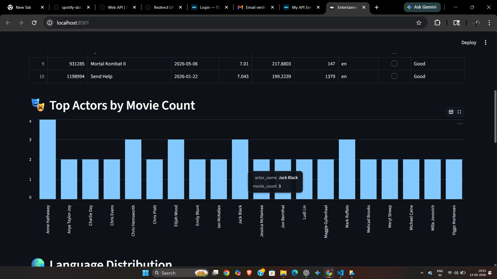
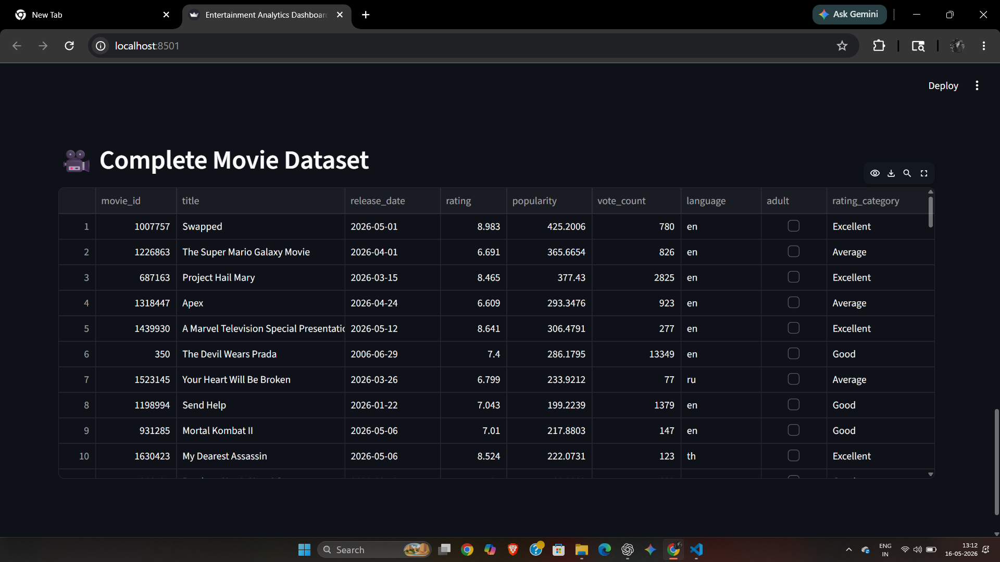
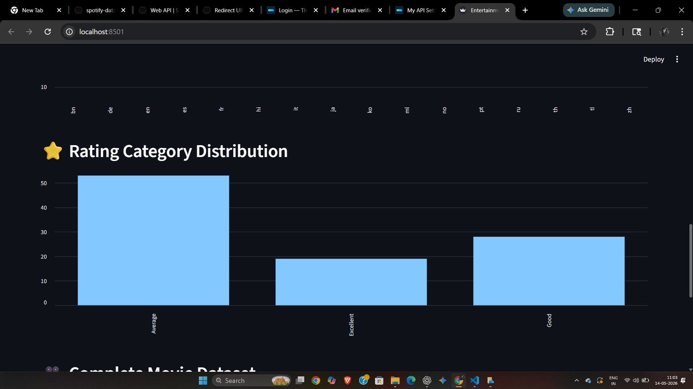
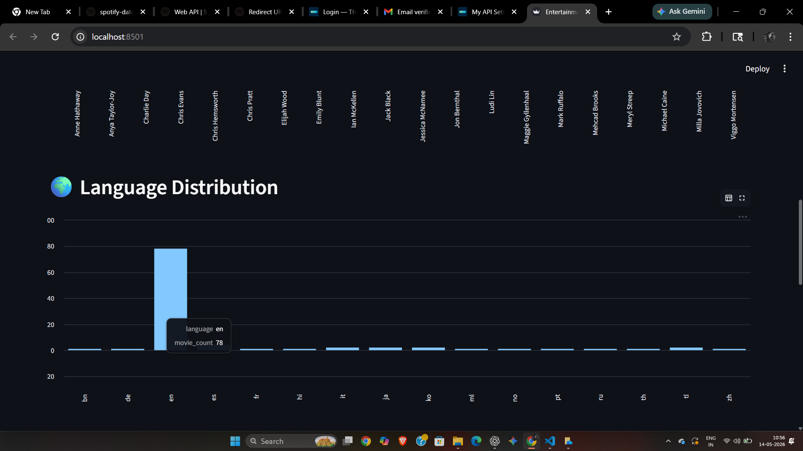

# 🎬 Entertainment Analytics Pipeline

An end-to-end Data Engineering and Analytics Engineering project built using Python, TMDB APIs, Pandas, and Streamlit.

This project extracts movie and cast data from TMDB APIs, processes it through a Medallion Architecture (Bronze → Silver → Gold), performs data quality validations, and visualizes insights through an interactive Streamlit dashboard.

---

# 🚀 Project Overview

The pipeline performs:

- Multi-page API extraction from TMDB
- Cast extraction using chained API calls
- Raw data ingestion and storage
- Data cleaning and transformation
- Feature engineering
- Aggregations and KPI generation
- Data quality validation
- Interactive dashboard visualization

The project simulates a real-world Analytics Engineering pipeline used in modern data platforms.

---

# 🏗️ Architecture

```text
TMDB API
   ↓
Extraction Layer
   ↓
Raw JSON Storage (Bronze)
   ↓
Transformation Layer
   ↓
Cleaned + Analytics Datasets (Silver + Gold)
   ↓
Load + Validation Layer
   ↓
Streamlit Dashboard
```

---

# ⚙️ Tech Stack

| Technology | Purpose                           |
| ---------- | --------------------------------- |
| Python     | Core pipeline development         |
| Pandas     | Data transformation and analytics |
| TMDB API   | Source data extraction            |
| Streamlit  | Dashboard visualization           |
| JSON       | Raw data storage                  |
| CSV        | Processed datasets                |
| Logging    | Pipeline monitoring               |

---

# 🔥 Features

## ✅ Extraction Layer

- Multi-page API extraction
- API authentication using Bearer Token
- API chaining for cast extraction
- Raw JSON ingestion

## ✅ Transformation Layer

- Bronze / Silver / Gold architecture
- Data cleaning
- Feature engineering
- Denormalization
- Aggregations and analytics generation

## ✅ Load Layer

- Data quality checks
- Duplicate detection
- Null validation
- Business rule validation
- Pipeline metrics generation

## ✅ Dashboard Layer

- KPI cards
- Actor analytics
- Language analytics
- Rating category analysis
- Interactive tables

---

# 📊 Dashboard Screenshots

## Dashboard Overview



---

## Actor Analytics



---

## Movie Dataset



## Rating Category



## Language Distribution



---

# 📂 Project Structure

entertainment-analytics-pipeline/
│
├── assets/
│ └── screenshots/
│
├── config/
│ └── config.py
│
├── data/
│ ├── raw/
│ │ ├── movies_raw.json
│ │ └── cast_raw.json
│ │
│ └── processed/
│ ├── movies_cleaned.csv
│ ├── genres_cleaned.csv
│ ├── cast_cleaned.csv
│ ├── top_movies.csv
│ ├── actor_analytics.csv
│ ├── language_analytics.csv
│ ├── dashboard_summary.csv
│ ├── movie_dashboard.csv
│ ├── data_quality_report.csv
│ └── pipeline_metrics.csv
│
├── dashboard/
│ └── app.py
│
├── logs/
│ └── pipeline.log
│
├── src/
│ ├── extract.py
│ ├── transform.py
│ └── load.py
│
├── main.py
├── requirements.txt
└── README.md

````

---

# ▶️ Pipeline Execution

Run the complete pipeline:

```bash
python main.py
````

Run the Streamlit dashboard:

```bash
streamlit run dashboard/app.py
```

---

# 📈 Analytics Generated

The pipeline generates:

- Top movies analytics
- Actor analytics
- Language distribution
- Rating category distribution
- Dashboard KPIs
- Data quality reports
- Pipeline monitoring metrics

---

# 🧠 Data Engineering Concepts Demonstrated

- API Engineering
- Pagination Handling
- Chained API Calls
- Relational Data Modeling
- Medallion Architecture
- Data Cleaning
- Denormalization
- Aggregation Pipelines
- Data Quality Validation
- Monitoring & Logging
- Dashboard Visualization

---

# 👩‍💻 Author

Payal Pandey

Aspiring Data Engineer | Cloud & Analytics Enthusiast
